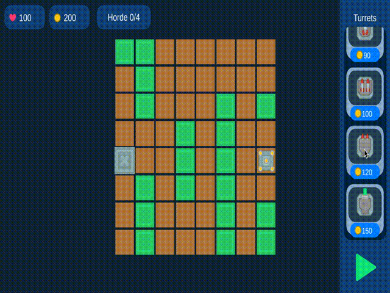
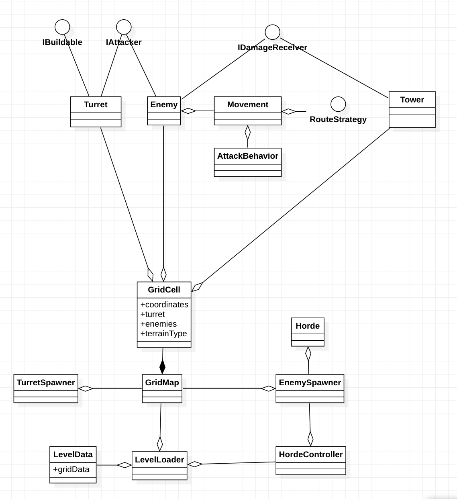

# TowerDefense

Implementación de tower defense con distintos tipos de torretas y distintos tipos de enemigos utilizando Unity 2020.3.10f1

La definición de cada torreta y enemigo está establecida en un Scriptable Object el cual permite modificar rápidamente
el balance y probar nuevos comportamientos.

La definición de cada nivel, tanto de la estructura del tablero como las hordas, están definidas en un Scriptable Object,
haciendo así muy fácil agregar nuevos niveles con configuraciones completamente diferentes.

Los tipos de torretas son:
-Cañón
-Cañón doble
-Metralleta
-Lanza misiles (3 distintos). Causan Splash Damage.
-Láser. Provoca daño en línea afectando a todos los enemigos que se encuentren en el camino.

Los tipos de enemigos son:
-Soldado 1.
-Soldado 2.
-Soldado 3.
-Cyborg. Dispara láser a larga distancia.
-Avión 1. Dispara metralleta.
-Avión 2. Dispara misiles.

Este demo cuenta con 4 niveles completamente funcionales. 
Escena de prueba: GameScene.unity

Diagrama inicial que hice para tener una idea general de la estructura del proyecto. No toda la arquitectura quedó exactamente igual, pero sí su mayoría.
Se añadieron varias clases más que no están registradas en este diagrama, incluyendo las clases relacionadas a UI y comportamientos específicos.

